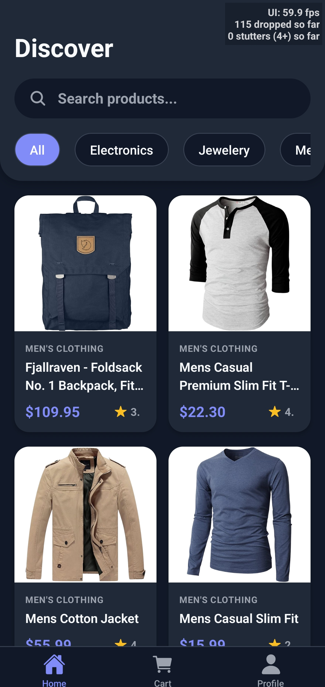
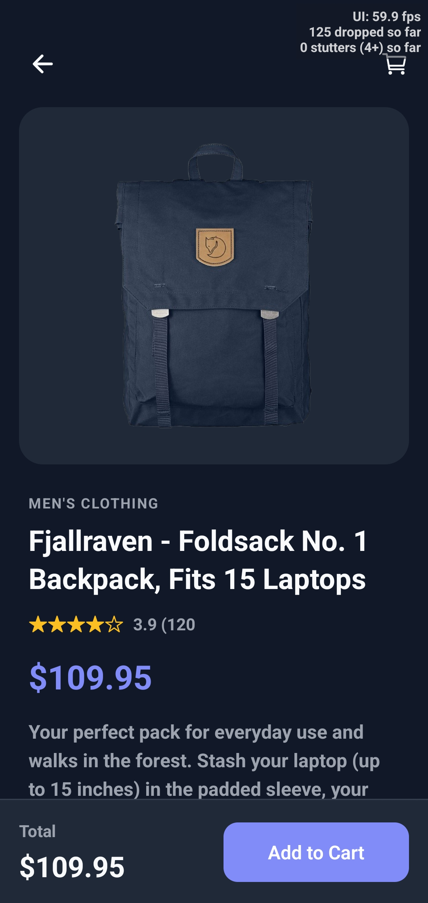
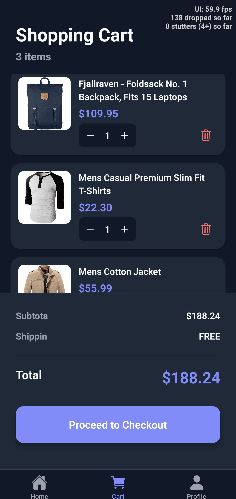
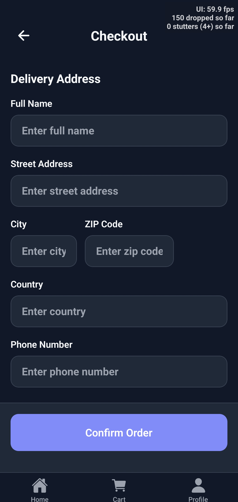
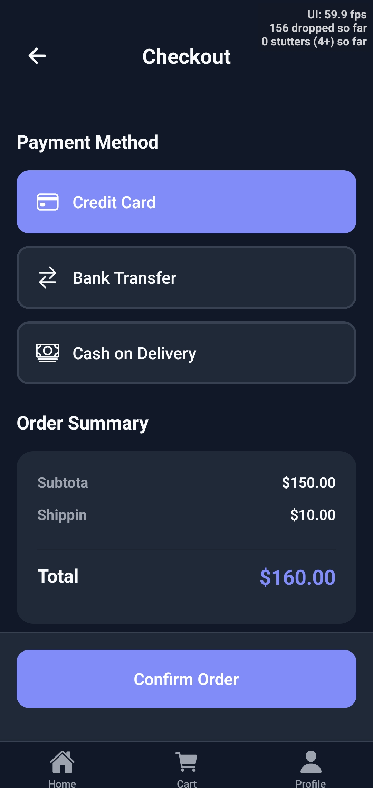
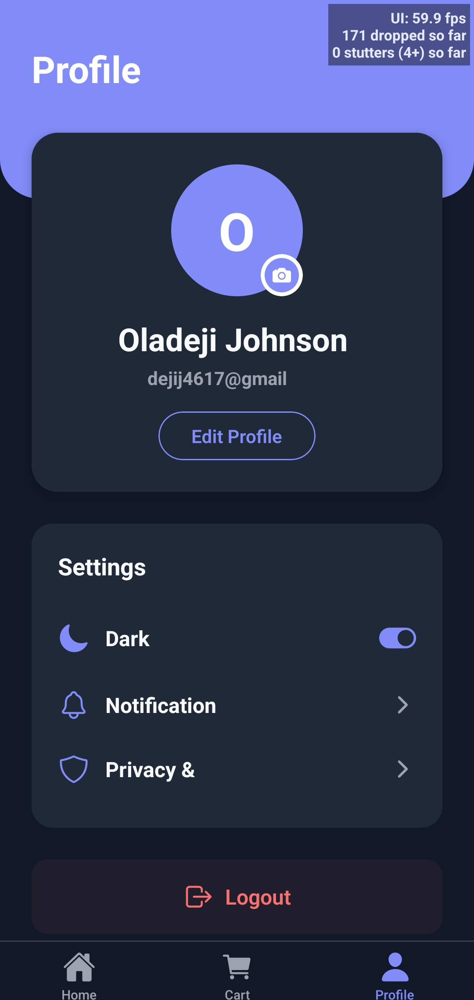

# ShopMaster - Mobile E-Commerce Application

## Description
ShopMaster is a fully functional mobile e-commerce application built with React Native and Expo. It provides a complete shopping experience including product browsing, cart management, checkout simulation, and user profile management with secure authentication.

## Features Implemented

### Core Features
- **Splash Screen**: Animated logo with auto-navigation after 2.5 seconds
- **Authentication Flow**: 
  - Login with email/password validation
  - Registration with form validation
  - Secure token storage using Expo SecureStore
  - Protected routes preventing unauthorized access
  - Logout functionality with confirmation
- **Home Screen (Product Listing)**:
  - Real-time product search
  - Category filtering
  - Product grid with images, names, prices, and ratings
  - Pull-to-refresh functionality
  - Loading states and error handling
- **Product Details Screen**:
  - Large product image
  - Full product information
  - Quantity selector
  - Add to cart functionality
- **Cart Screen**:
  - List of added items with images
  - Increase/decrease quantity
  - Remove items
  - Subtotal and total calculation
  - Empty state design
  - Persistent cart storage
- **Checkout Screen**:
  - Delivery address form
  - Payment method selection (Card/Transfer/Cash)
  - Order summary
  - Order confirmation simulation
- **Profile Screen**:
  - Display user information
  - Profile image picker from gallery
  - Edit profile functionality
  - Dark mode toggle
  - Logout button

### Bonus Features
- **Dark Mode**: Complete theme switching with persistence
- **Category Filtering**: Filter products by category
- **Animations**: Smooth transitions and micro-interactions

## Tech Stack
- **React Native**: Core framework
- **Expo**: Development platform and tooling
- **Expo Router**: File-based navigation with tabs layout
- **Expo SecureStore**: Secure authentication token storage
- **Expo Image Picker**: Profile image selection
- **FakeStoreAPI**: Product data source
- **Context API**: State management for auth and theme

## Folder Structure
app/
├── _layout.tsx              # Root layout with providers
├── splash.tsx               # Splash screen with animations
├── (auth)/                  # Authentication group
│   ├── _layout.tsx          # Auth layout with redirect logic
│   ├── login.tsx            # Login screen
│   └── register.tsx         # Registration screen
├── (tabs)/                  # Main app tabs
│   ├── _layout.tsx          # Tabs configuration
│   ├── index.tsx            # Home/Products screen
│   ├── cart.tsx             # Shopping cart
│   ├── checkout.tsx         # Checkout flow
│   └── profile.tsx          # User profile
└── product/
└── [id].tsx             # Dynamic product details
components/                  # Reusable components (if needed)
context/
├── AuthContext.tsx          # Authentication state management
└── ThemeContext.tsx         # Theme/dark mode management
services/
├── api.ts                   # API calls to FakeStoreAPI
└── storage.ts               # Secure storage wrapper
types/
└── index.ts                 # TypeScript type definitions


**Structure Explanation**:
- **Grouping by Feature**: Auth and Tabs are grouped using Expo Router's convention
- **Secure Storage**: All sensitive data (tokens, cart) use SecureStore instead of AsyncStorage
- **Context Pattern**: Auth and Theme are global contexts avoiding prop drilling
- **File-based Routing**: Expo Router handles navigation automatically based on file structure

## Optimization Techniques Used

### useMemo
- **Home Screen**: `filteredProducts` - Prevents re-filtering on every render when search/category hasn't changed
- **Cart Screen**: `subtotal`, `totalItems`, `shipping`, `total` calculations - Only recalculates when cart items change
- **Product Details**: `totalPrice` - Memoized price calculation based on quantity

### useCallback
- **All event handlers**: `handleLogin`, `handleRegister`, `updateQuantity`, `removeItem`, `handleProductPress`
- **Navigation handlers**: Prevent unnecessary re-renders of child components
- **API calls**: `fetchProducts`, `fetchProduct` wrapped in useCallback to maintain reference stability

### React.memo
- **ProductCard**: Prevents re-render of product cards when parent updates but props haven't changed
- **CartItemCard**: Optimizes cart list performance when updating single item quantities

### Additional Optimizations
- **FlatList optimization**: `keyExtractor`, `getItemLayout` (implicit), and proper `renderItem` memoization
- **Image caching**: React Native's built-in image caching for product images
- **Lazy loading**: Screens load on-demand with Expo Router

## Challenges Faced

### 1. Secure Storage Implementation
**Challenge**: Finding the right balance between security and performance for cart persistence.
**Solution**: Used Expo SecureStore for both auth tokens AND cart data, ensuring cart persists across app restarts securely.

### 2. Navigation State Management
**Challenge**: Preventing authenticated users from accessing auth screens and vice versa.
**Solution**: Implemented layout-level redirects in `(auth)/_layout.tsx` and `(tabs)/_layout.tsx` using the AuthContext.

### 3. Theme Persistence
**Challenge**: Maintaining dark mode preference across app restarts.
**Solution**: Stored theme preference with user data in SecureStore, loading it during app initialization.

### 4. Cart State Synchronization
**Challenge**: Keeping cart state in sync between multiple screens and persistence layer.
**Solution**: Used useEffect to watch cart changes and auto-persist to SecureStore, with initial load on mount.

### 5. Image Loading Performance
**Challenge**: Product images from FakeStoreAPI loading slowly and causing layout shifts.
**Solution**: Added proper `resizeMode="contain"`, fixed dimensions, and placeholder backgrounds.

### 6. Form Validation UX
**Challenge**: Providing immediate feedback without being intrusive.
**Solution**: Implemented inline error messages with smooth animations and proper keyboard handling.

## Screenshots
- Splash screen

- Login screen

- Home screen

- Product details

- Cart

- Checkout


- Profile


## Running the App

```bash
# Install dependencies
npm install

# Start the development server
npx expo start

# Run on iOS
npx expo run:ios

# Run on Android
npx expo run:android